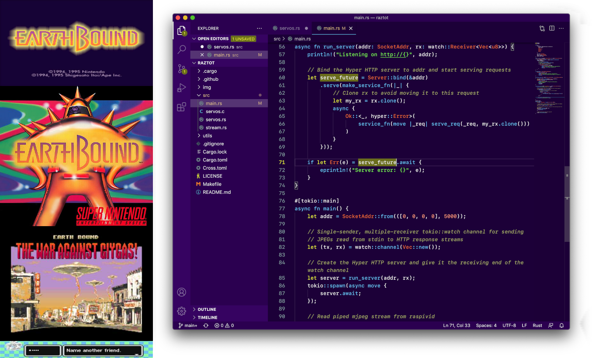
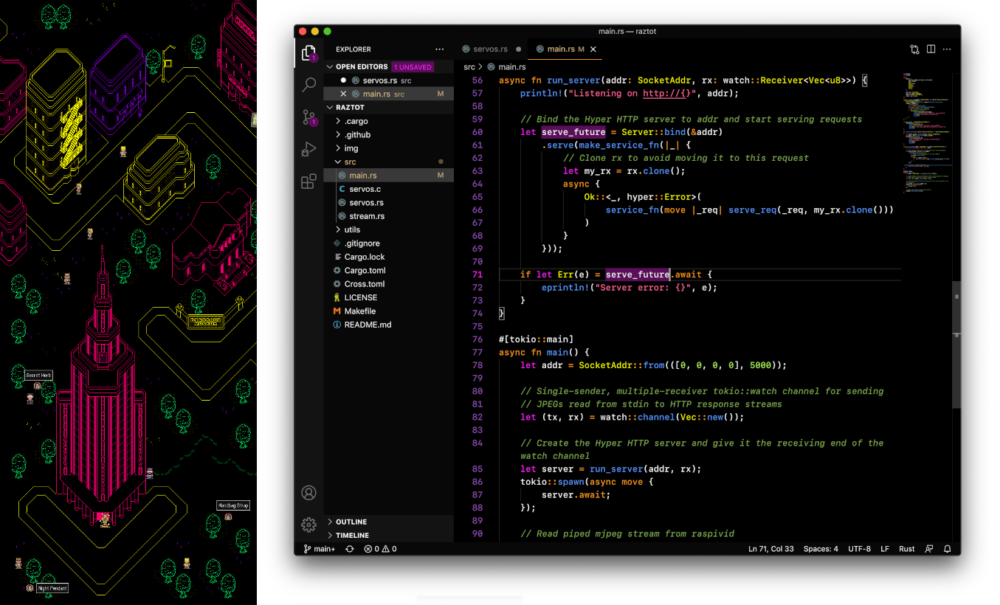
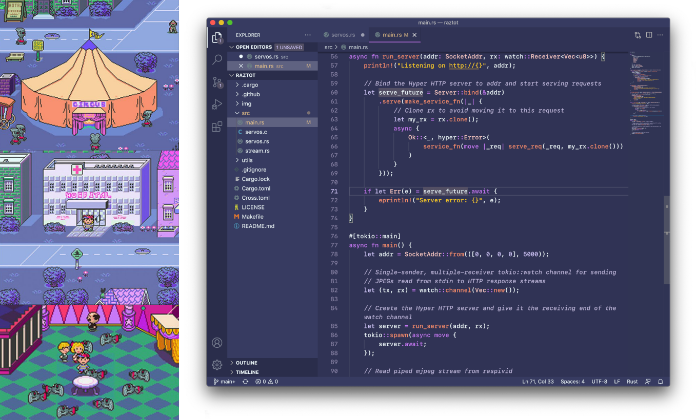
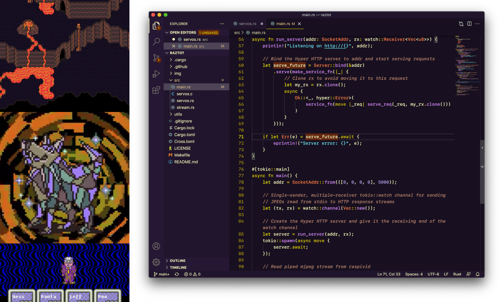
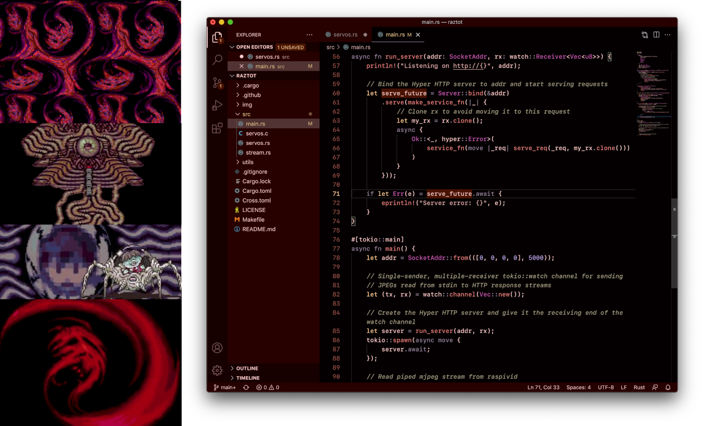
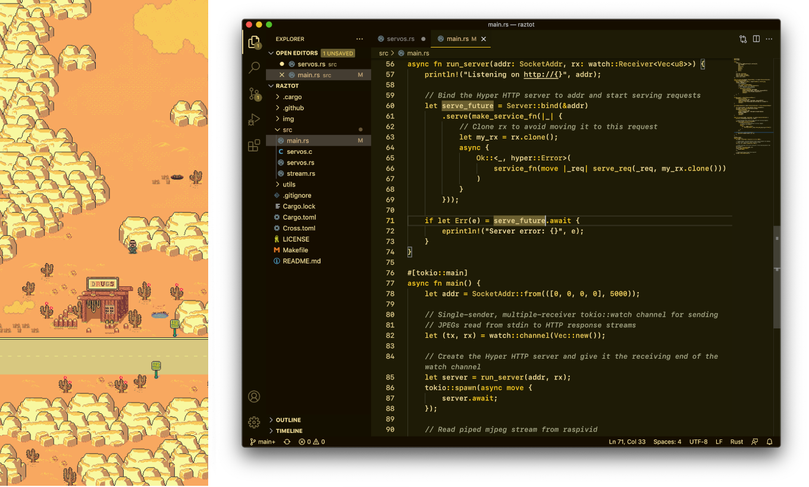
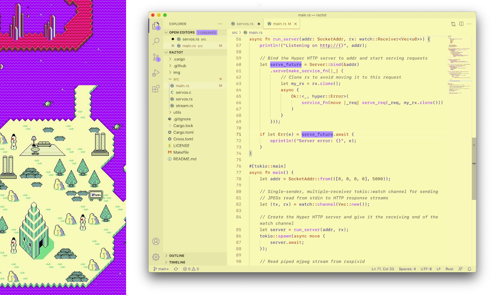
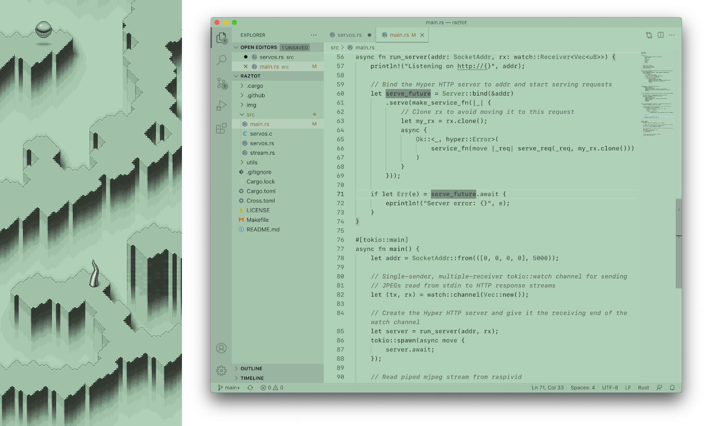

<p align="center">
  
</p>

:art: *A command line tool to generate color themes for editors (Vim, VSCode, Sublime, Atom) and terminal emulators (iTerm2, Hyper).*

[](http://opensource.org/licenses/MIT)
[](https://github.com/benbusby/colorstorm/releases/)
[](https://github.com/benbusby/colorstorm/actions)

___

Contents
1. [Install](#install)
1. [Usage](#usage)
1. [Creating Themes](#creating-themes)
1. [Screenshots](#screenshots)

## Install

### Arch Linux (AUR)

`yay -S colorstorm`

### Other distros

In progress, check back soon!

### From Source

- Install [Zig](https://github.com/ziglang/zig/wiki/Install-Zig-from-a-Package-Manager)
- Run: `make release`
- Move `zig-out/bin/colorstorm` into your `PATH`

## Usage

```bash
$ colorstorm [-o outdir] [-g generator] input

-o|--outdir: The directory to output themes to (default: "./colorstorm-out")
-g|--gen:    Generator type (default: all)
             Available types: all, atom, vscode, vim, sublime, iterm, hyper
-i|--input:  The JSON input file to use for generating the themes
             See: https://github.com/benbusby/colorstorm#creating-themes
```

#### Supported Editors
- Vim
- VSCode
- Sublime
- Atom

#### Supported Terminal Emulators
- iTerm2
- Hyper

## Creating Themes

You can create themes for all available editors and terminal emulators using a
single JSON file to define the colors. The file should be an array (even for
one theme), with the following structure:

```json
[
    {
        "theme_name_full": "Moonside",
        "theme_name_safe": "moonside",
        "color_bg_main": "#000000",
        "color_bg_alt1": "#080808",
        "color_bg_alt2": "#131313",
        "color_fg": "#ffffff",
        "color_linenr": "#9e5dc8",
        "color_select": "#5a1359",
        "color_type": "#f6f929",
        "color_accent": "#fd35fa",
        "color_string": "#ff6693",
        "color_boolean": "#fd9935",
        "color_variable": "#c67ff4",
        "color_number": "#aaef64",
        "color_comment": "#7ca454",
        "color_function": "#5e9aff"
    },
    {
        ...
    }
]
```

Value names are mostly self-explanatory, but here is a breakdown of what each field means:

<table>
    <tr>
        <td>Field</td>
        <td>Explanation</td>
    </tr>
    <tr>
        <td><code>theme_name_full</code></td>
        <td>The full name of the theme that will appear in theme file documentation</td>
    </tr>
    <tr>
        <td><code>theme_name_safe</code>/td>
        <td>The value to use as the filename for the theme</td>
    </tr>
    <tr>
        <td><code>color_bg_main</code>/td>
        <td>Primary background color</td>
    </tr>
    <tr>
        <td><code>color_bg_alt1</code>/td>
        <td>A separate background color to use for UI elements like file trees and tab bars</td>
    </tr>
    <tr>
        <td><code>color_bg_alt2</code>/td>
        <td>A separate background color to use for UI elements like line numbers and gutters</td>
    </tr>
    <tr>
        <td><code>color_fg</code>/td>
        <td>The foreground color (all generic text)</td>
    </tr>
    <tr>
        <td><code>color_linenr</code>/td>
        <td>The color used for line numbers</td>
    </tr>
    <tr>
        <td><code>color_select</code>/td>
        <td>The color used for selecting a word or lines of text</td>
    </tr>
    <tr>
        <td><code>color_type</code>/td>
        <td>The color used for variable types (int, float, etc)</td>
    </tr>
    <tr>
        <td><code>color_accent</code>/td>
        <td>An "accent" color -- typically used for special cases (like current line number highlight or badge backgrounds)</td>
    </tr>
    <tr>
        <td><code>color_string</code>/td>
        <td>The color used for strings</td>
    </tr>
    <tr>
        <td><code>color_boolean</code>/td>
        <td>The color used for boolean values</td>
    </tr>
    <tr>
        <td><code>color_variable</code>/td>
        <td>The color used for variable instances and constants</td>
    </tr>
    <tr>
        <td><code>color_number</code>/td>
        <td>The color used for numeric values</td>
    </tr>
    <tr>
        <td><code>color_comment</code>/td>
        <td>The color used for code comments</td>
    </tr>
    <tr>
        <td><code>color_function</code>/td>
        <td>The color used for function names</td>
    </tr>
</table>

## Screenshots

- [Earthbound Themes](https://github.com/benbusby/earthbound-themes)

[](https://www.vim.org/scripts/script.php?script_id=5920)
[](https://marketplace.visualstudio.com/items?itemName=benbusby.earthbound-themes)
[](https://packagecontrol.io/packages/Earthbound%20Themes)
[](https://atom.io/packages/earthbound-themes-syntax)

### Earthbound



### Moonside



### Zombie Threed



### Fire Spring



### Devil's Machine



### Dusty Dunes



### Magicant (Light Theme)



### Cave of the Past (Monochrome)


