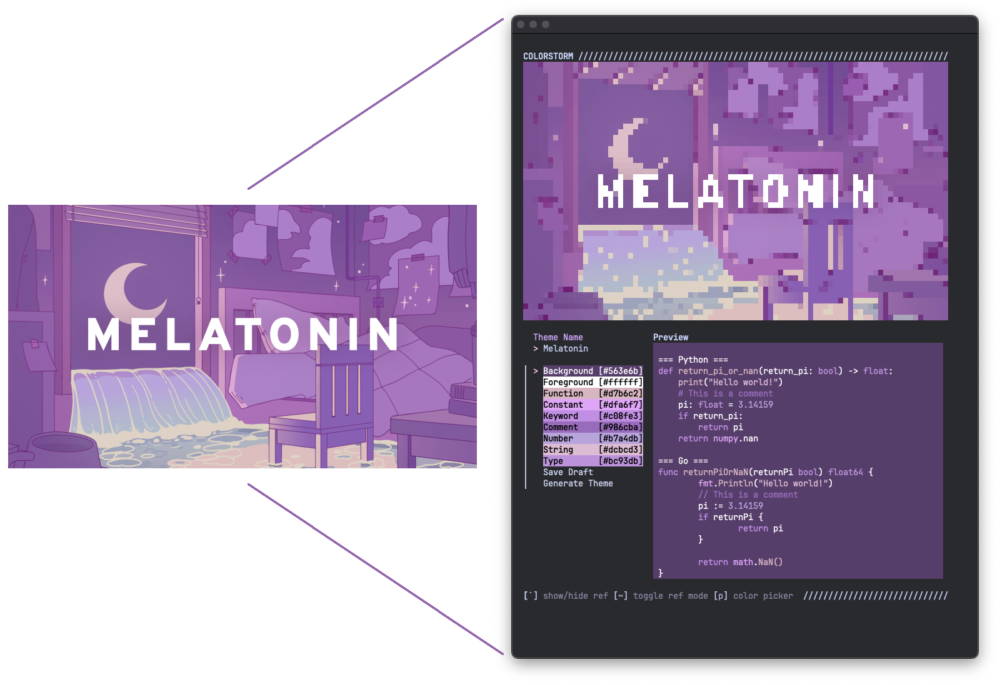
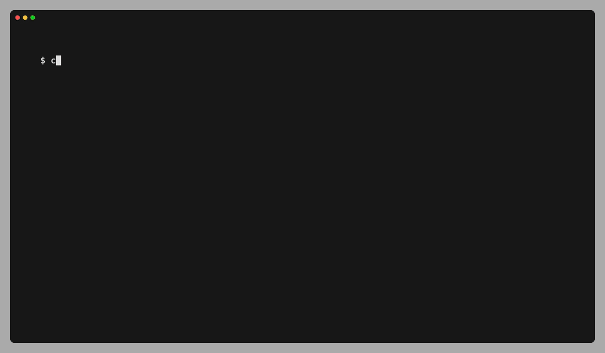
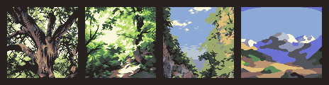
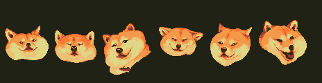
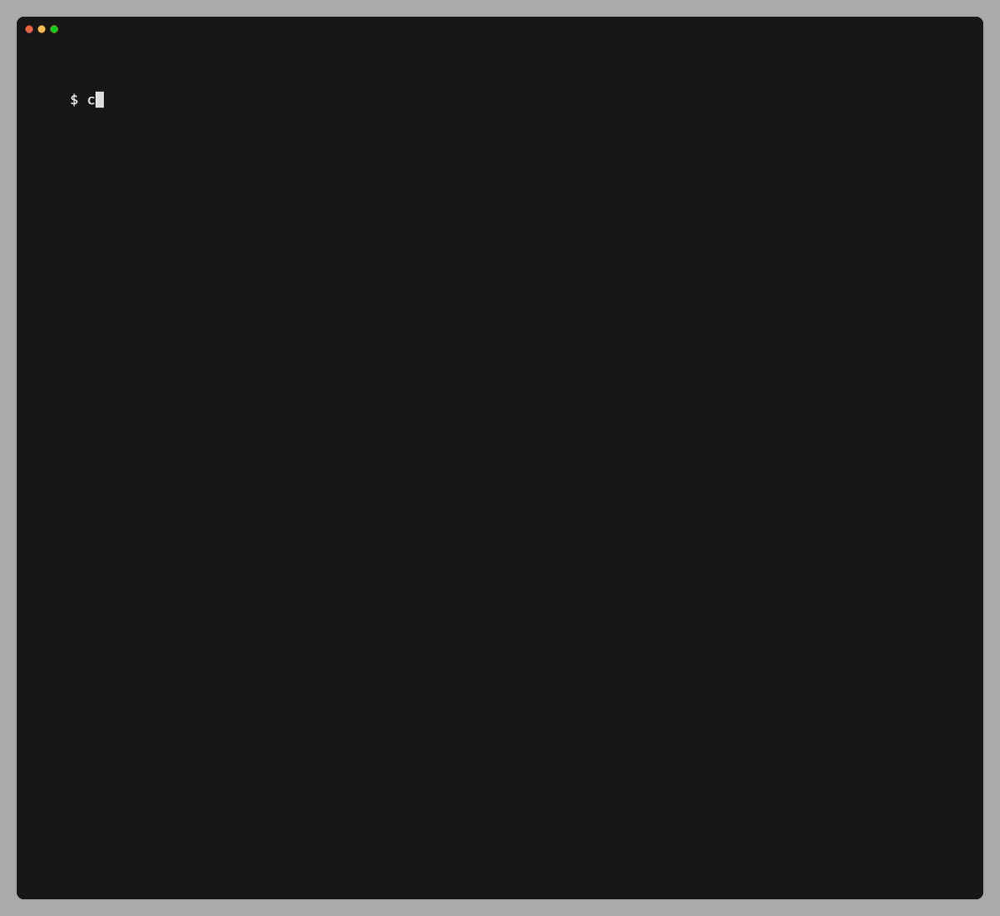

<p align="center">
  
</p>

:art: *A command line TUI to generate color themes for Vim, VSCode, and Sublime.*

[](http://opensource.org/licenses/MIT)
[](https://github.com/benbusby/colorstorm/releases/)
[](https://github.com/benbusby/colorstorm/actions)

___



Contents
1. [Features](#features)
1. [Install](#install)
1. [Usage](#usage)
1. [Demos](#demos)
    - [Generate Dark Theme](#generate-dark-theme)
    - [Generate Light Theme](#generate-light-theme)
    - [Generate Monochromatic Theme](#generate-monochromatic-theme)
    - [Using a Reference Image](#using-a-reference-image)
    - [Using the Color Picker](#using-the-color-picker)
1. [Examples](#examples)

## Features

- Full TUI for creating themes for Vim / Neovim, VSCode, and Sublime
- Different built-in color theme generators:
    - Random
    - Monochromatic
    - No color (black and white)
- Define and edit colors using hex, RGB, and/or HSV
- Import images to use as a reference
- Color picker for sampling colors from an image directly
- Light and dark theme creation support
- Export draft theme files (including reference image if applicable) to a single portable JSON file

## Install

### Binaries

Pre-compiled binaries are available for Windows, macOS, and Linux [
on the releases page](https://github.com/benbusby/colorstorm/releases).

### From Source

- Install [Go](https://go.dev/doc/install)
- Run: `go build`
- Move `./colorstorm` into your `$PATH`

## Usage

```bash
colorstorm
  -c string
    	seed color (hex)
  -f string
    	load theme json file
  -i string
    	jpg or png reference image
  -l	create a light theme
  -m	generate monochrome theme
  -q int
    	color quantization amount [0-255] (default 0)
  -x	initialize without any colors
```

#### Inside Colorstorm
```
Default:
Tab/Arrow Keys/Enter -- navigation

If an image was imported:
`   -- toggle image visibility
~   -- toggle image mode (visual vs list of colors)
p   -- initiate color picker

Color picker shortcuts:
Arrow keys -- move picker location
Enter      -- confirm color selection
Escape     -- cancel color picker
```

#### Supported Editors
- Vim
- VSCode
- Sublime

## Demos

### Generate Dark Theme

`$ colorstorm`

This command will generate a random editable **dark** color theme. Re-running the
command will result in a different theme each time.


### Generate Light Theme

`$ colorstorm -l`

This command will generate a random editable **light** color theme. Re-running the
command will result in a different theme each time.



### Generate Monochromatic Theme

`$ colorstorm -m`

This command will generate a random **monochromatic** color theme. Re-running the
command will result in a different theme each time.


### Using a Reference Image

You can pass a reference image to colorstorm, which will convert it into a set of
colored ASCII half-block characters and render it above the theme editor.

When an image is provided, you can toggle between viewing the image and the list of
colors in the image using the `~` key.

#### Demo Image:



`$ colorstorm -i <path to image>`


### Using the Color Picker

When passing a reference image to colorstorm, you can use the built-in color picker
to select colors directly from the image to use in your theme.

When a theme field is focused (i.e. Background, Foreground, etc), press `p` to enable
the color picker. A white crosshair will appear on the image, and you can use the arrow
keys to move the crosshair around the image. The focused color will update with whatever
color is under the cursor in real time.

#### Demo Image:



`$ colorstorm -i <path to image>`



## Examples

### [Earthbound Themes](https://marketplace.visualstudio.com/items?itemName=benbusby.earthbound-themes)

[](https://www.vim.org/scripts/script.php?script_id=5920)
[](https://marketplace.visualstudio.com/items?itemName=benbusby.earthbound-themes)
[](https://packagecontrol.io/packages/Earthbound%20Themes)

### Earthbound


### Moonside


### Zombie Threed


### Fire Spring


### Devil's Machine


### Dusty Dunes


### Magicant (Light Theme)


### Cave of the Past (Monochrome)


