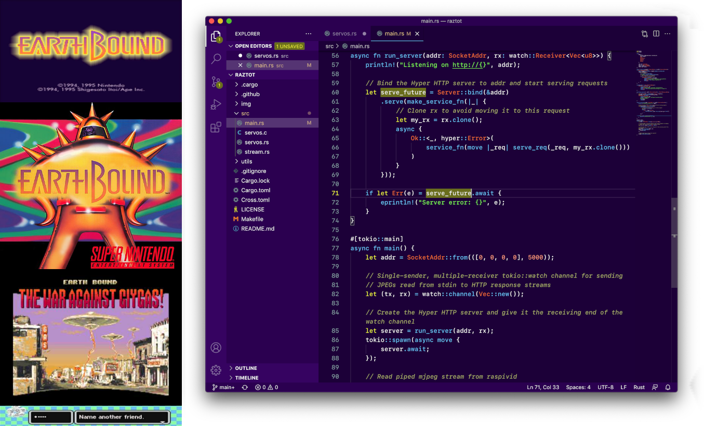
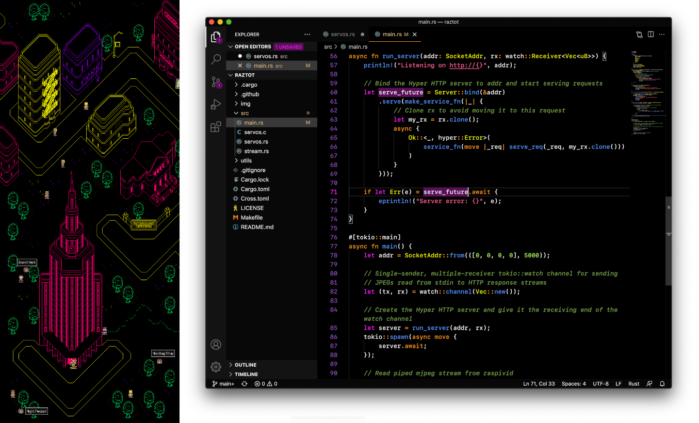
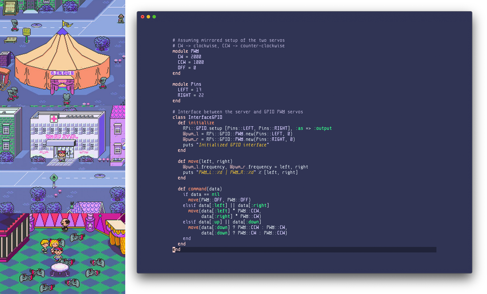
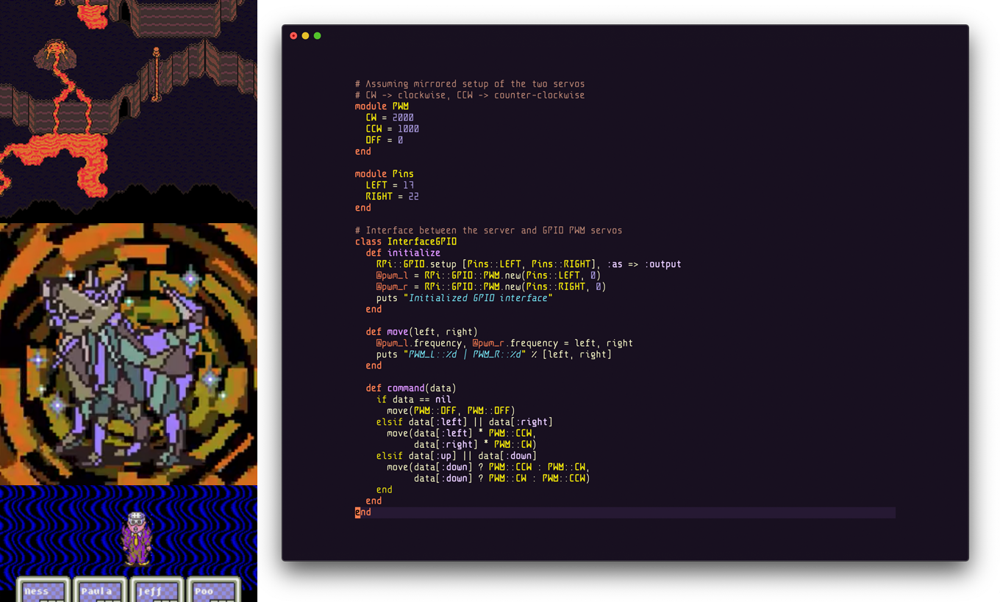
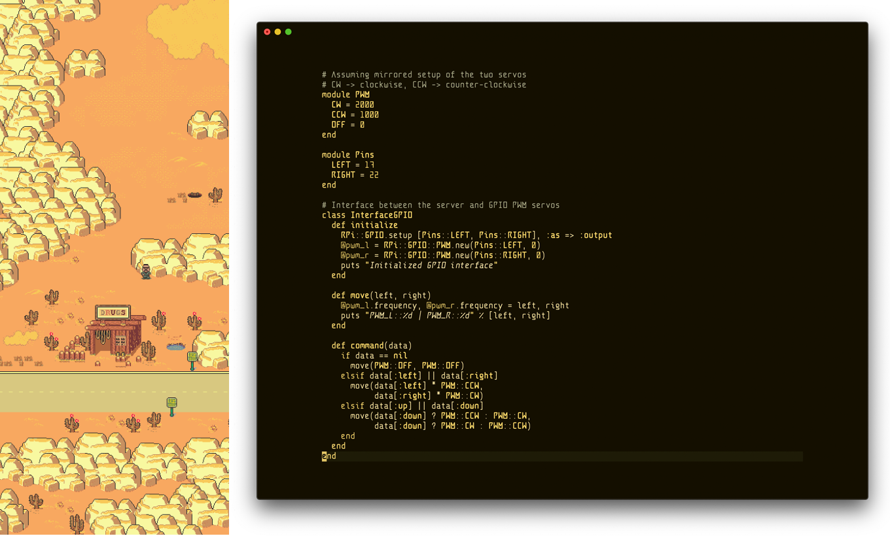
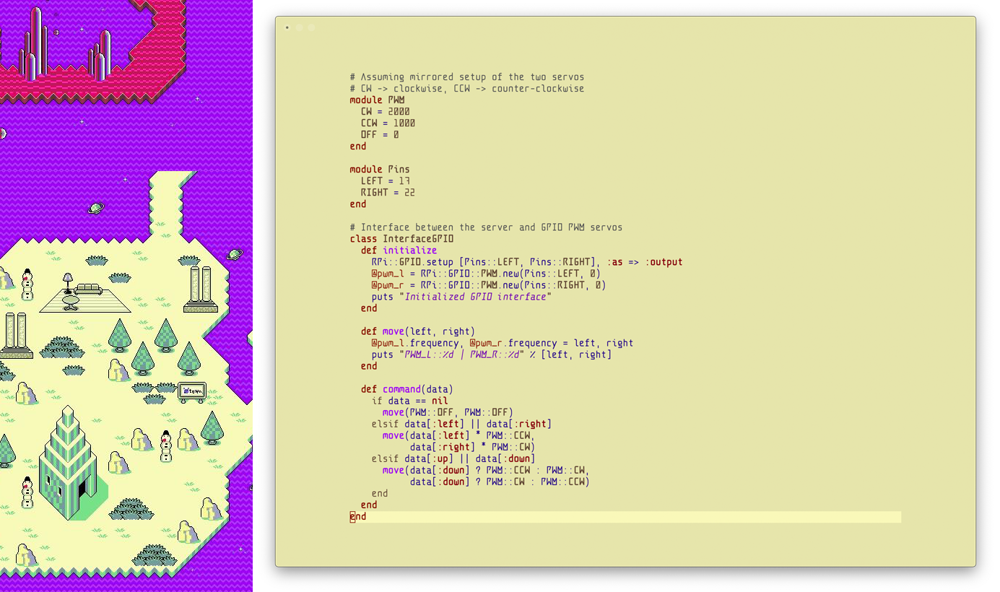

:art: *Code editor themes inspired by the memorable and bizarre locations from [Earthbound (aka Mother 2)](https://en.wikipedia.org/wiki/EarthBound).*   **Available now for [Vim](https://www.vim.org/scripts/script.php?script_id=5920), [VSCode](https://marketplace.visualstudio.com/items?itemName=benbusby.earthbound-themes), [Sublime](https://packagecontrol.io/packages/EarthboundThemes), and [Atom](https://atom.io/themes/earthbound-syntax)!**
___

## Current Themes
- Earthbound
- Moonside
- Zombie Threed
- Dusty Dunes
- Fire Spring
- Magicant (Light Theme)
- Cave of the Past (Monochromatic Theme)

Each theme is modeled after an iconic location in the game, and all color themes follow the AA/AAA color accessibility guidelines for all font sizes.

### "Darker" Themes
- Earthbound Darker
- Zombie Threed Darker
- Dusty Dunes Darker
- Fire Spring Darker

These themes are nearly identical to their "regular" theme counterparts, but use a darker background to provide a higher contrast alternative with the syntax colors.

#### Earthbound

#### Moonside

#### Zombie Threed

#### Fire Spring

#### Dusty Dunes

#### Magicant (Light Theme)

#### Cave of the Past (Monochrome)

## Currently Supported Editors
- [Vim](https://www.vim.org/scripts/script.php?script_id=5920)
- [VSCode](https://marketplace.visualstudio.com/items?itemName=benbusby.earthbound-themes)
- [Sublime](https://packagecontrol.io/packages/EarthboundThemes)
- [Atom](https://atom.io/themes/earthbound-syntax)
- IntelliJ (in progress)
- More coming soon!

## Installation
### Vim
Refer to [the vim submodule README](https://github.com/benbusby/vim-earthbound-themes) or [the plugin page on vim.org]()

### Visual Studio Code
Install through [the online marketplace](https://marketplace.visualstudio.com/items?itemName=benbusby.earthbound-themes), or by searching "Earthbound" in the extension manager in VSCode and installing from there.

### Sublime
Install through Sublime by searching "EarthboundThemes" ([package info available here](https://packagecontrol.io/packages/EarthboundThemes)).

### Atom
Install through [atom's online package site](https://atom.io/themes/earthbound-syntax), or by opening Atom and searching for "Earthbound" in Themes.

## Contributing
Contributions and PRs are highly encouraged for improvements, new color themes, support for other editors, etc.

If there are any issues with the color schemes, or if one of them has poor contrast in a particular setting, please let me know by [opening an issue](https://github.com/benbusby/earthbound-themes/issues/new).

## Credits
- Screenshot font is [Anomaly Mono](https://github.com/benbusby/anomaly-mono)
- Atom theme switcher adapted from Dayle Rees' Rainglow themes for Atom (https://github.com/rainglow/atom)
